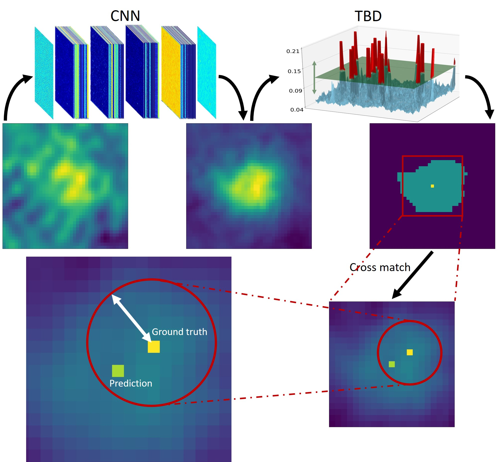
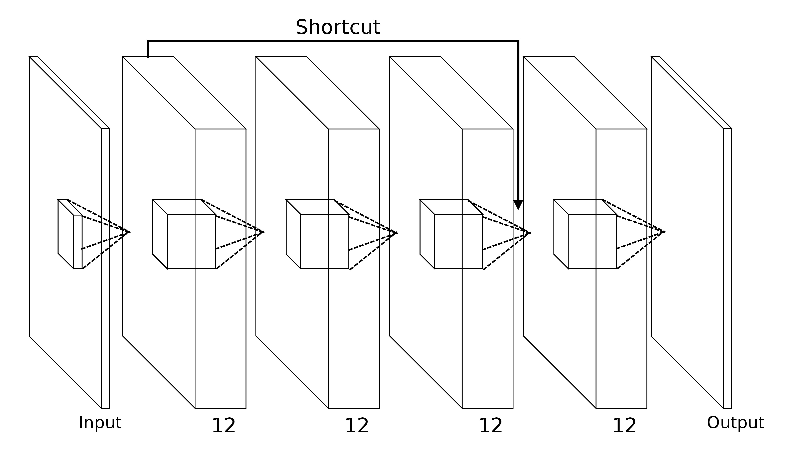

DeepSource9
=======

Installation:

The project is hosted on GitHub. Get a copy by running:

$ git clone https://github.com/vafaei-ar/deepsource.git

Install the package using:

$ cd deepsource9 $ pip install -r requirements.txt $ python setup.py install

**DeepSource9** is a flexible and expendable point source detection package for radio telescope images. It takes simulated images and catalogs to train a neural network as signal to noise magnifier. Then it can provide a catalog of predicted point sources by thresholding bob detection (TBD).

Before training, it provides a demaned map from true catalogs. The edge and top view of the demand map is shown below:

  

  

_Python library for _

**Documentation:** http://

**Citing DeepSource9:** 
