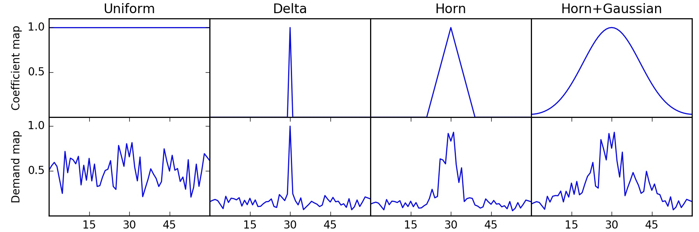
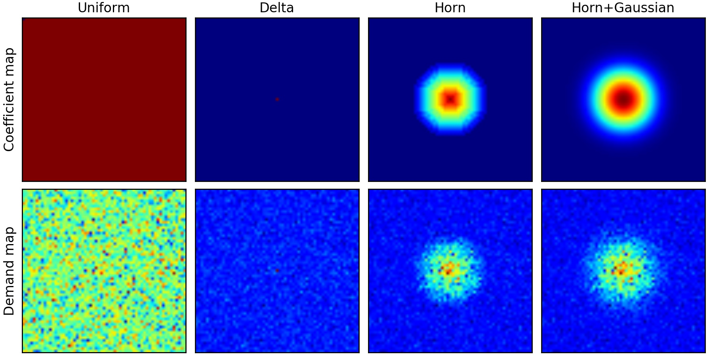
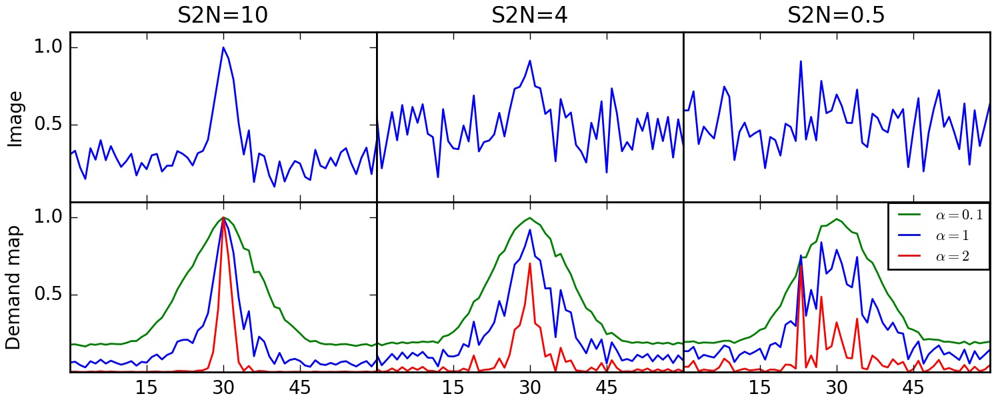
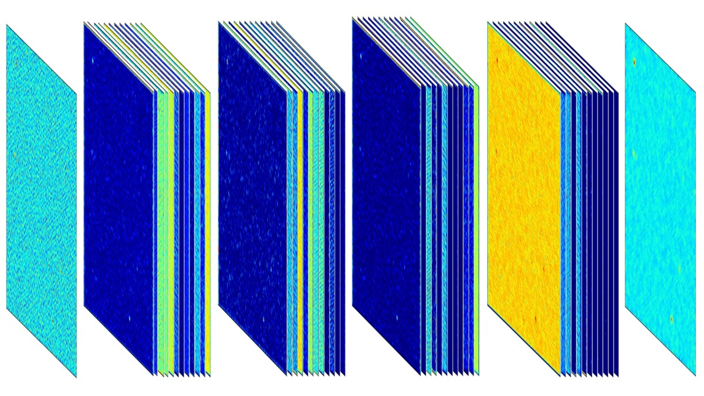
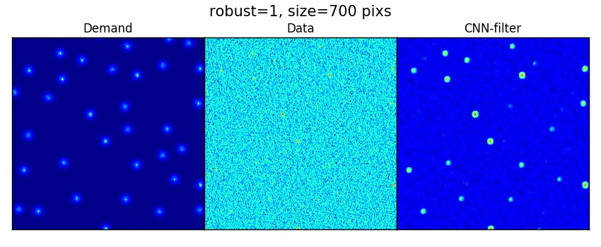

DeepSource9
=======

Installation:

The project is hosted on GitHub. Get a copy by running:

$ git clone https://github.com/vafaeiar/deepsource9

Install the package like this:

$ cd deepsource9 $ pip install -r requirements.txt $ python setup.py install

**DeepSource9** is a flexible and extendable point source detection package for radio telescope images. It takes simulated images and catalogs to train and learn about beam and correlated noise in them. Then it can provide a catalog of predicted point sources.

Before training, it provides a deman map from true catalogs. The edge and top view of the demand map is shown below:

  

  

  

  

  

  

_Python library for _

**Documentation:** http://

**Mailing list:** https://

**Citing DeepSource9:** 
